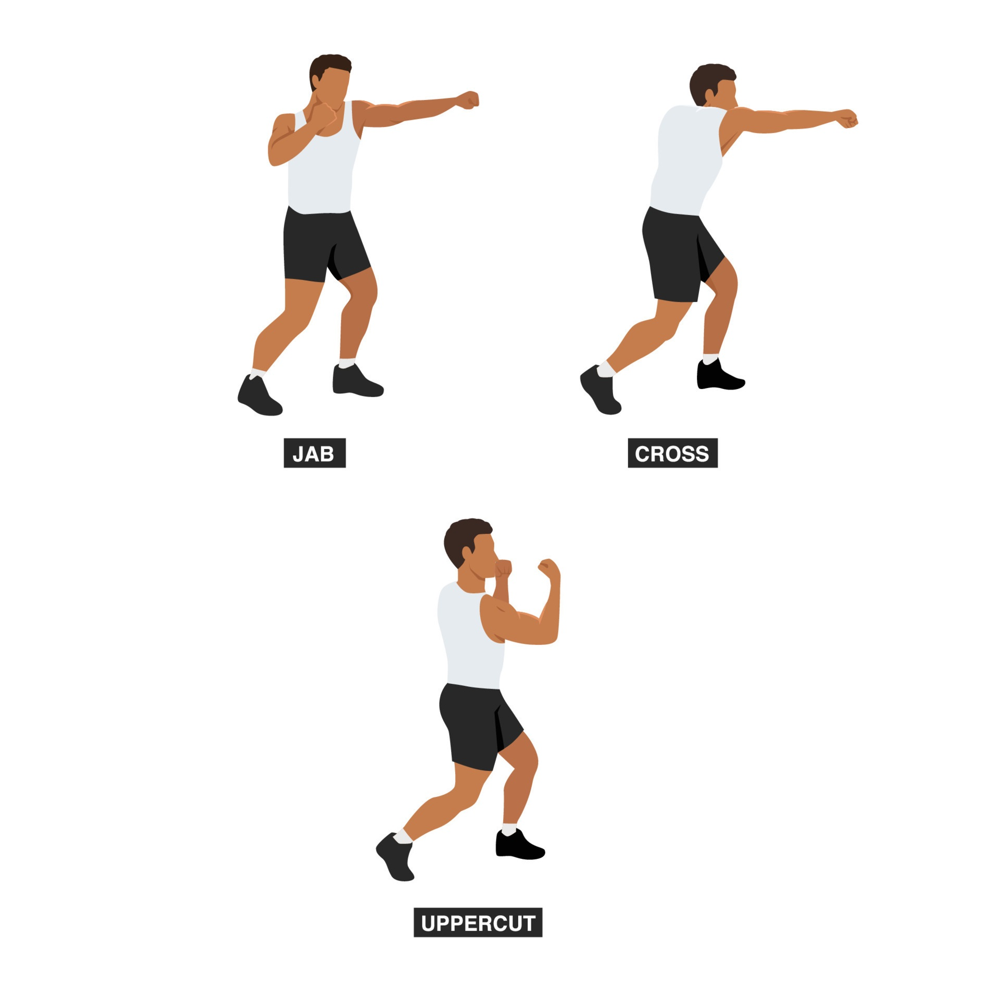
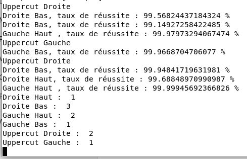

# Introduction
Shadowboxing is a common tactic used in combat sports, especially boxing. This entails playing out a fight against an imaginary opponent, who is frequently represented by a shadow (thus the English word "shadow"). In shadowboxing, the practitioner moves, strikes, and defends in a manner similar to that of an actual fight—just without a real partner in front of them. This project aims to develop a working prototype of an embedded system that can recognize boxing motions while a practitioner is shadowboxing. This project focuses on the jab, cross, and uppercut movements.

<p align="center" width="100%">
    
</p>

## How does it work ?
Built upon Google's PoseNet pose estimation model code, the original repository can be accessed via the following link: [project-posenet](https://github.com/google-coral/project-posenet).
I used it to extract keypoints and then conduct a purely analytical analysis of the movements to detect the boxing motions.
Begin by cloning this repository, then follow these steps:

Install all additional requirements for third-party libraries using the following command:
```
sh install_requirements.sh
```
To run the program, execute one of the following commands depending on your preferred resolution:
```bash
python3 pose_camera.py --res 480x360  # fast but low res
python3 pose_camera.py --res 640x480  # default
python3 pose_camera.py --res 1280x720 # slower but high res
```
## Demonstration 
https://github.com/TAIBIAchraf/Boxing-movement-detection-on-Google-Coral-Dev-Board/assets/114927888/146b8068-f699-4744-90a0-fe28cdf61771

And the output is also sent to the terminal:
<p align="center" width="100%">
    
</p>

## References
[Get started with the Dev Board | Coral](https://coral.ai/docs/dev-board/get-started)

[Real-time Human Pose Estimation in the Browser with TensorFlow.js](https://medium.com/tensorflow/real-time-human-pose-estimation-in-the-browser-with-tensorflow-js-7dd0bc881cd5)

[PersonLab: Person Pose Estimation and Instance Segmentation with a Bottom-Up, Part-Based, Geometric Embedding Model](https://arxiv.org/abs/1803.08225)
